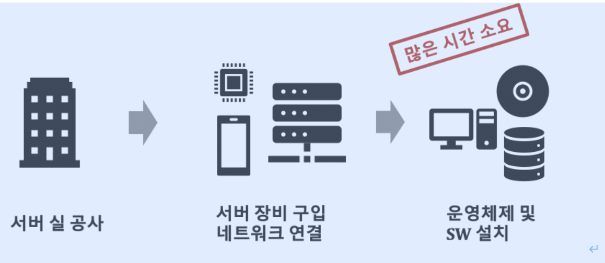
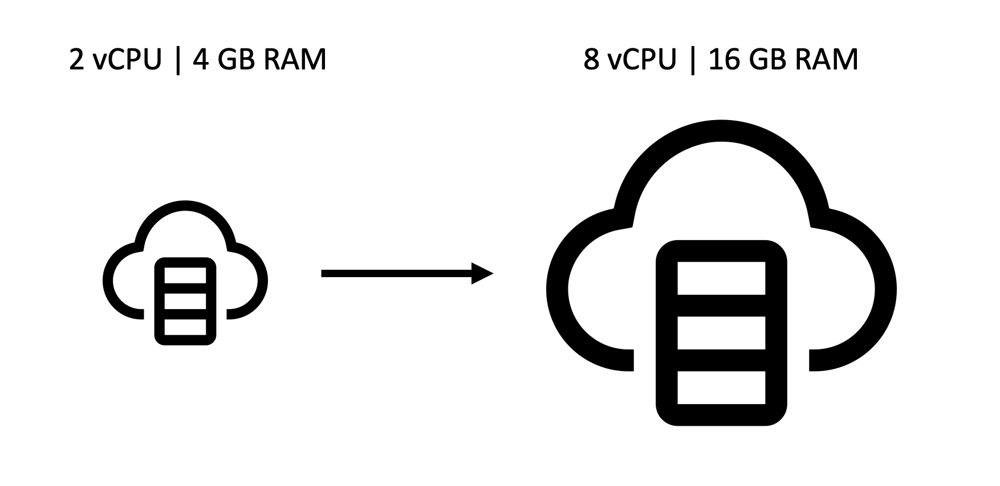
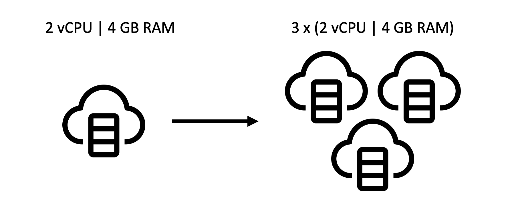
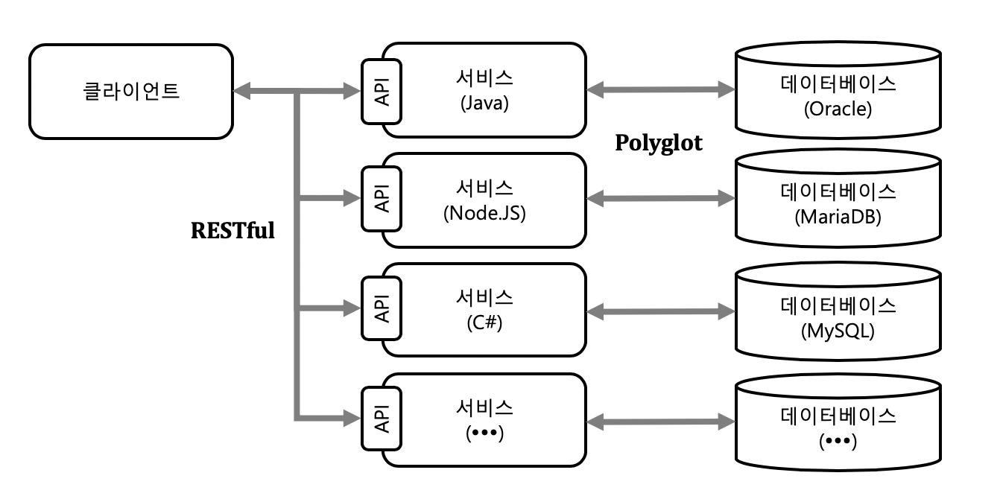
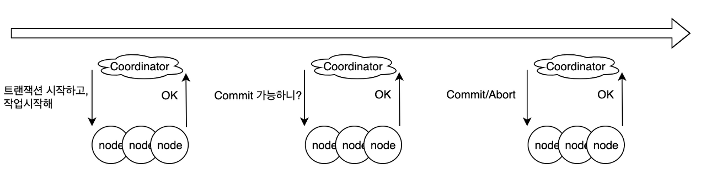
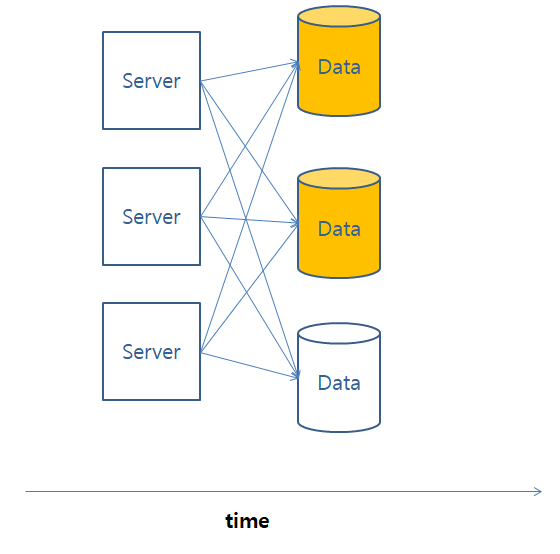

### 2023-05-12

## **도메인 주도 설계**

### **아마존 비즈니스 민첩성의 비밀**

### 1-1. 비즈니스 민첩성

- 비즈니스는 계속 변경되므로 이에 맞추어 개선된 시스템도 꾸준히 배포되어야 한다.

- 서비스는 기획,분석,설계,구현 과장(소프트웨어 개발 5단계 일부를 말하는 것 같음)을 거쳐 빌드되고 배포된다. 아마존은 1.5초마다 서비스를 변경하고 개선한다. 

- 빠른 배포 주기를 통해 비즈니스 민첩성을 간접적으로 보여준다. 어떻게 이런 것이 가능한가?

---

### 1-2. 클라우드 인프라



- 새로운 서비스 개발을 위해 다음 과정처럼 개인이 직접 인프라를 구축하려고 하면 많은 시간이 걸릴 것이며, 투자 비용 또한 적지 않을 것이다.

- 이러한 문제를 클라우드 인프라가 서비스(AWS, Azure, GCP, Oracle 등)의 등장으로 해결할 수 있게 되었다.

- 이를 통해 필요한 만큼만 쉽고 빠르게 사용할 수 있으며 사용한만큼만 지불하는 방식으로 비용을 유연하게 조정할 수 있다.

    ### 스케일 업과 스케일 아웃

        - 스케일 업(Scale-Up)은 기존 시스템 자체의 물리적 용량을 증가시켜 성능을 높이는 방법이다.(데이터 처리량을 증가)
            -> Clock 속도(2GHz -> 5GHz)를 올리거나, 메모리를 증가(2GB -> 16GB)시킨다.

        - 스케일 아웃(Scale-Out)은 기존 시스템과 용량이 같은 다수의 장비를 추가하여 가용성을 높이는 방법이다.(용량을 분산시켜 처리)
            -> 2GHz, 2GB 메모리를 가지고 있는 장비를 여러대 추가한다.

      


※ 쉽게 성능 및 가용성을 높일 수 있는 이유.

 - 클라우드는 여러 개의 서버 장비가 모여 논리적으로 하나처럼 관리된다. 즉 필요한 블록(서버 장비)만큼만 쉽게 분리하여 사용할 수 있기 때문이다.

 ---

### 1-3 특정 서비스만 탄력성 있게 확장하는법

```Text
시스템 운영자 입장에서 운영할 때 다양한 기능들이 있지만 1주일 동안 진행되는 세일 이벤트 부분에만 트래픽이 몰릴 경우 전체 서비스를 증설하고 복제하는 것은 낭비일 것이다.

이에 따라 세일 이벤트를 담당하는 부분만 복제하여 트래픽에 대비할 수 있도록 블록을 나누면 된다.
```
1. 세일 서비스를 분리하여 세일 서비스의 용량을 고려하여 증설한다.(스케일 업)

2. 독립된 세일 서비스의 트래픽이 증가할 경우 인스턴스를 복제하도록 설정한다. (스케일 아웃)

3. 16GB를 사용하던 서비스를 32GB로 증설하지 않고 16GB중 사용하던 세일 서비스의 메모리 양(예: 4GB)을 늘린 후 이를 복제한다.

4. 분리되어 배포되있기 때문에 나머지 서비스 또한 일부분만 변경하여 배포가 가능하다.

---

### 1-4 마이크로서비스란?

여러 개의 조각으로 서비스를 구성하여 별개의 인스턴스로 로딩한 뒤 이를 모아 하나의 비즈니스 애플리케이션을 구성하는 서비스.

장점:

- 비즈니스 기능 단위로 구성하여 업무 단위로 모듈 경계가 명확하다.

- 특정 기능별로 독립적으로 확장이 가능하다.

- 해당 서비스만 자동화 하여 독립적으로 배포가 가능하다.

- 중앙 집중적 관리는 최소화함으로써 각 서비스에 대해 서로 다른 언어로 개발할 수 있다.

    

- 마이크로서비스의 특성상 각 기술자(UI,서버개발,DB 등)이 분리되어 일하는 것보다는 하나의 서비스를 처음부터 끝까지 만들기 위해 필요한 모든 기술자들을 하나의 팀이 되어 만드는 것이 효율적이다.

```Text
이를 통해 스스로 각 팀이 필요한 방법론을 탐색하고 기술을 찾아 적용할 수 있다.

 예를 들어 검색이 최우선인 팀은 NoSQL + Node.js를 사용할 수도 있고, 계약 서비스가 필요한 팀은 Java + Oracle + Redis 등을 사용할 수 있다.
```

--- 

### 1-5 개발 방식의 변화

- 마이크로서비스를 통해 프로젝트가 아니라 제품 중심으로 변화하였으며, 폭포수 모델 , 빅뱅 방식 보다는 반복적 모델, 애자일 개발 방식을 사용하게 된다. (개발 생명주기의 변화)

- 클라우드를 통해 개발지원 환경의 자동화를 갖춤으로써 인프라를 자동화 하여 팀의 개발 속도와 품질을 높인다. (개발 환경의 변화)
    
    - 소스코드 빌드 -> 개발 환경 배포 -> 테스트 환경 배포 -> 스테이징 환경 배포 -> 운영 환경 배포

- 스토리지 가격 인하 + 네트워크 대역폭 상승으로 인해 각 서비스별로 다른 DB를 분산되어 설계한다.(저장소의 변화)

```Text
그러나 DB를 분산할 경우 각 DB에 대한 데이터 정합성을 맞추기 위해 데이터 일관성 처리를 해야 한다.

여기서는 2단계 커밋(TWO-PHASE COMMIT)[1] 방식이 아닌 비동기 이벤트를 통해 일관성을 처리한다.

    - 예를 들어 주문 서비스와 배송 서비스가 있고 각 저장소가 분리되어 있을 때, 주문을 하였으면 배송이 가야만 하는 비즈니스는 하나의 트랜잭션으로 볼 수 있다.
    
    - 두 서비스를 하나의 트랜잭션으로 묶으면 서비스를 분리한 효과가 의미 없을 수 있다. 

    ! 따라서 각 트랜잭션을 분리하고 큐 자료구조를 이용해 보상 트랜잭션[3]을 활용한다.
```

- 소프트웨어는 언제든 실패할 수 있기 때문에 실패하지 않는 시스템을 만들기 위해 완벽을 추구하는 것보다 실패에 빠르게 대응할 수 있는 시스템을 만드는 것이 더 효율적이다. (위기 대응 방식의 변화)
    - 다양한 실패 테스트 하기, 실시간 모니터링(서킷 브레이커 패턴) 등


---

### Index

[1] 2단계 커밋 - 분삭 트랜잭션 처리를 위해 여러 노드간에 원자성 트랜잭션 커밋을 보장하기 위한 분산 알고리즘

    

1. 위와 같은 모든 노드에서 분산 트랜잭션을 시작하고 보장하기 위해 여러 트랜잭션을 관리하는 Coordinator(조정자)가 필요하다.
2. 준비 단계 : Coordinator는 모든 참여 노드에 준비 요청을 보내 트랜잭션 준비를 요청한다. 각 노드는 트랜잭션을 로컬에서 실행한뒤 commit 할 수 있는지 준비 상태를 나타내는 응답을 보냅니다.
3. 결정 단계: 준비 단계에서 받은 응답을 기반으로 Coordinator는 모든 노드가 커밋할 준비가 되었는지 또는 중단을 원하는 노드가 있는지 결정한다. 하나라도 commit이 될 수 없는 경우일 경우 전체 노드들에게 abort를 보내고 모두 OK일 경우 commit 한다.
4. 커밋/중단 단계: 커밋 또는 중단 요청을 수신하면 각 참여 노드는 최종 커밋 또는 중단 작업을 실행하고 트랜잭션 중에 보유한 모든 리소스를 해제한 뒤 Coordinator의 리소스를 기다린다.

2단계 커밋은 일관성을 보장하지만 노드가 응답하지 않거나 중간에 오류가 발생할 경우 시스템이 무기한 대기할 수 있는 문제가 나타날 수 있다.


[2] 결과적 일관성 - 일시적으로는 데이터가 불일치 할 수 있지만, 결국에는 모든 시스템이 최신의 데이터를 가질 수 있도록 보장한다는 개념



분산 컴퓨팅에서 고가용성을 보장하기 위한 방법 중 하나이며
주어진 데이터에 대한 변경이 없다면 해당 요소(Element)에 대한 모든 접근(Access)는 가장 최근에 변경된 내용을 가리킨다

[3] 보상 트랜잭션 - 원래 작업에서 진행하던 단계를 취소하고 작업을 시작할 때 시스템이 있던 상태로 바꿈으로써 원자성을 보장하는 것

- 비행기를 예약하고 객실을 예약하는 두 과정은 일관적이어야 할 때, 만약 하나가 실패할 경우 다른 하나도 실패를 해야 한다.

- 각 단계를 취소해야할 작업 또한 카운터(반대, 이전 작업의 효과를 되돌리거나 특정 작업을 실행 취소)작업 또한 기록한다.

- 실패할 경우 기록된 카운터 작업을 역순으로 실행한다.

- 그러나 시스템 상 롤백(항공편 취소)하면서 무조건 취소하는 것이 아닌 동일한 도시의 다른 호텔의 객실 제공하는 결정을 내릴 수 있도록 해야 한다.

- 그럼에도 고객은 여전히 취소를 진행하면 그대로 보상 트랜잭션이 계속 진행 된다.


### Reference
도메인 주도 설계로 시작하는 마이크로서비스 개발 - http://www.yes24.com/Product/Goods/98880996

https://gist.github.com/dalinaum/f735da250d9f013002733bf2dbcad563
https://jins-dev.tistory.com/entry/%EB%B6%84%EC%82%B0-%EC%8B%9C%EC%8A%A4%ED%85%9C-%ED%99%98%EA%B2%BD-Distributed-System-%EC%97%90%EC%84%9C-BASE-%EC%9B%90%EC%B9%99%EA%B3%BC-CAP-%EC%A0%95%EB%A6%AC
https://ohgym.tistory.com/49

https://learn.microsoft.com/ko-kr/azure/architecture/patterns/compensating-transaction