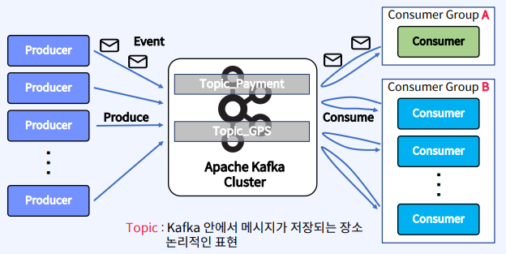
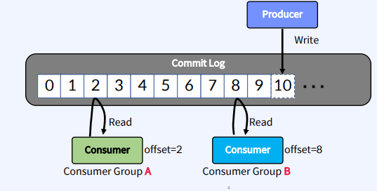
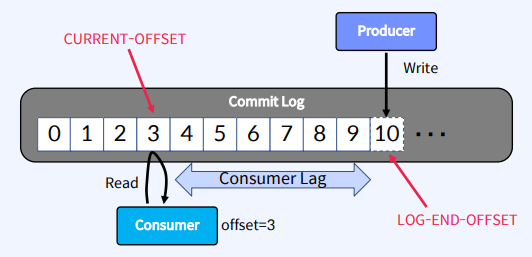
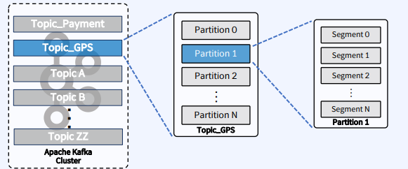
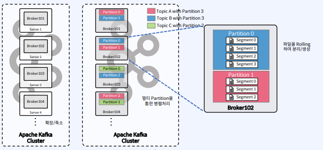
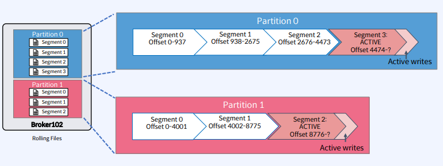

### 2023-05-21

## **Apache Kafka**

### 1.Apache Kafka는 무엇인가?

Data in Motion Platform

움직이는 데이터를 처리하는 플랫폼이다.

실시간으로 흐르는 이벤트 스트림을 받아주고 데이터를 필요로 하는 곳으로 데이터를 전송해주는 시스템

Event는 비즈니스에서 일어나는 모든 일(데이터)
```
웹 사이트에서 클릭하는 것

송금

GPS 좌표

센서의 온도/압력 데이터

그 외 등등
```

Event Stream : 비즈니스의 모든 영역에서 발생하는 모든 대용량의 데이터들에 대한 흐름이다.
 
### Apache Kafka의 특징

이벤트 스크림을 안전하게 전송 - Publish & Subscribe

이벤트 스크림을 디스크에 저장 - Write to Disk

이벤트 스트림을 분석 및 처리 - Processing & Analysis

### Apache Kafka는 어디에서 사용될까?
```
Messaging System

IOT 디바이스 혹은 애플리케이션에서 발생하는 데이터, 로그 수집

Realtime Event Stream Processing(Fraud Detection, 이상 감지 등)

DB 동기화(MSA 기반 분리되었을 때)

실시간 배치 및 ETL
```

보통 실시간 전송과 업데이트가 필요한 데이터 처리에 많이 사용된다.
- (교통, 금융, 오락, 온라인 이커머스 등)

---

### 2.Apache Kafka 기본 개념 및 이해

Topic,Producer,Consumer




Topic: Kafka 안에서 메시지가 저장되는 장소를 논리적으로 표현

Producer: 메시지를 만들어(Produce) Kafka의 Topic안에 저장할 데이터를 생성하고 전송

Consumer: Kafka의 Topic 내부의 파티션에 저장된 메시지를를 가져와서 소비(Consume)

Consumer Group: Topic의 메시지를 사용하기 위해 협력하는 Consumer들의 집합

- Consumer는 Consumer Group에 포함되며, Consumer들은 협력하여 Topic의 메시지를 처리함

---

### **Commit Log**

- 데이터 추가만 가능하고 변경이 불가능(Immutable)한 데이터 구조




Producer와 Consumer는 서로 알지 못한 채로 각각 Commit Log에 Write 및 Read 수행

Commit Log에 있는 Event(Message)를 동시에 다른 위치에서 Read가 가능함.

Offset - Commit Log에서 Event의 위치



Producer가 Write하는 맨 끝 커밋로그 위치를 LOG-END-OFFSET

Consumer가 읽어서 여기까지 읽었다고 커밋하는 위치를 CURRENT-OFFSET

LOG-END-OFFSET - CURRENT-OFFSET 위치의 차이를 Consumer Lag

---

### **Logical View**



**Partion**: Commit Log이며, 하나의 Topic은 하나의 Partition으로 구성됨. 병렬처리(Throughput 향상)를 위해 다수의 Partition 사용

- Partion0의 Offset 1번과 Partion1의 Offset 1번은 아무런 관계가 없다.

**Segment**: 메시지가 저장되는 실제 물리 File

 - Segment File이 지정된 크기보다 커지거나 오래되면 메시지는 새 파일에 추가된다.(rolling 방식)

Topic은 논리적으로 저장되는 장소이기 때문에 보이지 않는다.

Partition(Commit Log)부터 눈에 보이는 디렉토리, 파일 등을 의미한다.
```
Apache Kafka Cluster : Topic
Topic_GPS : Partition
Partition1 : Segment
```


---

### **Physical View**



**Topic 생성시 Partition 개수를 지정**하고, 각 Partition은 Broker들에 의해 분산되며 Segment FILE로 구성된다.

 - Apache Kafka Cluster 내에 Broker101, Broker102 등 여러개의 Broker 들이 존재하는 것을 볼 수 있다.

 - 만약 Topic A를 Partition 3개를 가지고 만들겠다고 한다면 Topic A의 Partition들은 Broker들에게 분산이 되어 만들어진다.

 - Topic B를 Partition 3개를 가지고 만들겠다고 한다면 Topic B의 Partition들도 Broker들에게 분산이 되어 만들어진다.

 - Topic C처럼 Partition 2개를 가지고 만들어도 마찬가지로 Broker들에게 분산되어 만들어진다. 

 - Broker Cluster가 최적의 곳에 Partition들을 위치 시킨다.

Partition 0번과 Partition 1번에 각각 Segment가 Rolling 방식으로 되어 있다.

---

### **Rolling Strategy**

- Segment File이 커지는 것을 방지하기 위해 롤링 정책은 다음과 같이 저장된다.

```
log.segment.bytes(default 1GB)

log.roll.hours(default 168 hours)
```
- Segment File은 분리시켜서 만든다. 하나의 시스템내에 10GB, 100GB 파일을 만들 수는 없기 때문이다.

- 따라서 Segment File을 용량이나 시간에 따라 분리시켜서 만든다.

---

### **Active Segment** 



Partition 당 하나의 Segment만 활성화(Active writes) 되어 있음 
    
- 이는 데이터가 계속 쓰여지고 있다는 뜻.

파일을 끊고 나간 Segment 들에는 Write가 불가능함. 

---

Index
[1] Throughput : 통신과정에서 네트워크 상의 어떤 노드나 터미널로부터 다른 터미널로 전달

[2] rolling 방식 : 하나씩 파일을 추가하는 것을 의미하는데 그 조건은 보통 지정된 크기 이상이거나, 지정 날짜 이상이 되면 새로운 segment를 생성하는 것

---

Reference 
---
[1] FastCampus - Kafka 완전 정복 : 클러스터 구축부터 MSA 환경 활용까지

[2] https://velog.io/@hyun6ik/Apache-Kafka-Topic-Partition-Segment

[3] https://velog.io/@djm0727/%EC%B9%B4%ED%94%84%EC%B9%B4-%EB%82%B4%EB%B6%80-%EC%95%84%ED%82%A4%ED%85%8D%EC%B2%98