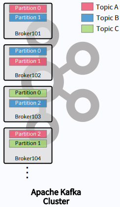

### 2023-05-22

## **Apache Kafka**

### Broker란?

 

- Apache Kafka는 Zookeeper와 Kafka Cluster로 구성되어 있고 여러개의 Broker들로 구성되어 있다.

#### **여기서는 Broker에 대해 설명한다.**

---

Kafka Broker(Kafka Server)는 Partion에 대한 Read와 Write를 관리하는 소프트웨어이다.
- Topic 내의 Partition 들을 분산, 유지 및 관리

- 각각의 Broker들은 ID로 식별됨 (ID는 숫자)

- Topic 데이터의 일부분(Partition)을 갖고 있음(데이터 전체를 갖고 있지 않음)
    
    - 장애가 났을 때 해당 파티션이 망가지면 데이터 전체가 망가지기 때문이다.

- 여러 개의 Broker들로 구성됨.

- Client(Consumer, Producer)가 메시지를 받아갈 때 특정 Broker에 연결하게 될 경우 전체 클러스터에 연결됨.

- 최소 3대 이상의 Broker를 하나의 Cluster로 구성해야 함(4대 이상 권장)

---

### Kafka Broker Id와 Partition Id의 관계

- Broker Id와 Partition Id는 아무런 관계가 없다.

- Topic을 만들 때 Partition 갯수를 지정하면 Kafka Cluster가 어디에 Partition, Disk를 많이 사용하고 있는지 판별한 뒤, 가장 적절한 Broker 위치에 둔다.

- Topic을 구성하는 Partition들은 여러 Broker 상에 분산된다.

- Topic 생성시 Kafka가 자동으로 Topic을 구성하는 전체 Partition들을 모든 Broker에게 할당 및 분배

--- 

### Bootstrap Servers(Broker Servers)

- Bootstrap 서버는 모든 Kafka Broker를 의미한다.

    1.Kafka Client(Producer/Consumer)(1)가 하나의 브로커에만 연결하면 

    2.그 브로커가 전체 브로커의 리스트를 전달(2)해준다. 

    3.전달 받은 정보를 통해 내가 메시지를 전달하거나 받아야할 토픽에 접속하여 연결한다.

- 윗 그림은 Broker101에만 연결되어 있으나 장애를 대비하여 Broker 전체의 리스트를 콤마(,)로 구분하여 사용하는 것이 기본이다.

---

Reference 
---
[1] FastCampus - Kafka 완전 정복 : 클러스터 구축부터 MSA 환경 활용까지

[2] https://velog.io/@hyun6ik/Apache-Kafka-Broker-Zookeeper

[3] https://m.blog.naver.com/alice_k106/220614228476