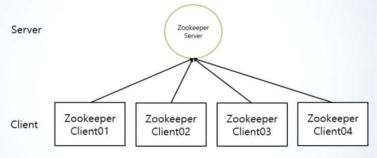
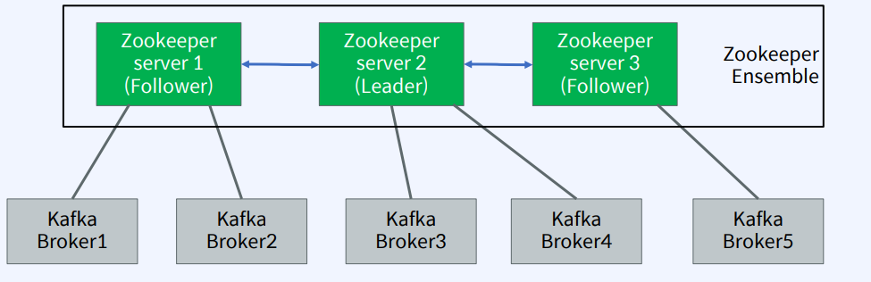
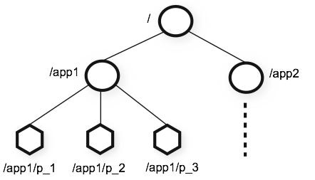

### 2023-05-26

## **Apache Kafka**

### Zookeeper란?
```
분산 처리 환경에서 시스템간의 정보를 공유하고, 서버들의 상태를 체크, 시스템을 관리하며 서버들 간의 동기화를 위한 락(lock)을 거는 등
각 서버간의 데이터가 변경 될 때 데이터를 처리 하기 위한 코디네이션(whdbfwk) 서비스이다.
```


분산 처리 시스템에서 발생하는 문제를 해결하고 관리해주기 위해 코디네이션 서비스가 존재한다.


- 코디네이션 서비스가 장애를 유발할 경우 시스템 전체에 영향을 미치기 때문에 이중화 등을 통해 고가용성을 제공해야 한다.

- Apache HBase(하둡 플랫폼을 위한 공개 비관계형 분산 NoSQL 데이터베이스), Kafka(대용량 분산 큐 시스템) 등에 사용된다.

- 분산 시스템을 코디네이션 하는 용도로 디자인이 되었기 때문에, 데이타 억세스가 빨라야 하며, 자체적으로 장애에 대한 대응성을 가져야 한다. 

- Zookeeper는 자체적으로 클러스터링을 제공하며, 장애에도 데이타 유실 없이 fail over/fail back이 가능하다.


### Zookeeper 아키텍처 1

---

Zookeeper의 기본 아키텍처는 다음과 같다.



- 맨 처음에 설명한 그림과 비슷한데 Zookeeper를 구동시키는 서버와 이에 접속하는 클라이언트(Apache Kafka에서는 Broker)로 나뉜다.

- 그렇다면 하나의 Zookeeper에 약 10만대씩 되는 클라이언트가 접속되어 있을 경우... 서버가 다운되면 fail되기 쉽고 고가용성에 문제가 생길 수 있다.


### Zookeeper 아키텍처 2

---



- 따라서 다음과 같이 분산형 Server를 통해 서버를 다중화하여 클라이언트(kafka broker)들을 관리함으로써 분산 동기화 서비스를 제공한다.

- 하나의 Leader와 Follower들로 나뉜다. 이들 Broker, Topic, Partition이 몇개인지 등의 정보를 가지고 있다.

- 하나의 Zookeeper가 죽어도 fail 되지 않고 지속적으로 동작이 가능하도록 해야 한다.

    - broker1과 broker2가 server1에 데이터를 저장하였을 경우 server1이 죽을 것을 대비하여 server2와 server3에 데이터를 저장(즉, 동기화)함으로써 고가용성을 제공한다.

    - 어떤 주키퍼 서버에 접근해도 동일한 데이터를 저장해야 하기 때문에 같은 데이터 저장구조를 가질 수 있어야 한다.

        - Zookeeper의 데이터 구조는 트리 형식으로 데이터를 저장하고 디렉터리처럼 노드를 확장시켜 나간다.

        

    - 클라이언트로부터 데이터 변경 요청이 들어왔을 경우 동기화 과정은 다음과 같다.

        - 임의의 서버(Follower)에 데이터 변경이 들어왔으나 데이터를 바로 변경하지 않는다.

        - 서버는 Leader에게 "데이터 전송이 들어왔다."라는 요청을 보낸다.

        - 리더는 Zookeeper 클러스터들한테 브로드캐스팅하여 **살아있는지** 물어본다.

        - **살아있다** 라는 응답을 전체 클러스터의 **☆과반수**가 넘을 경우 리더는 모든 서버에 업데이트를 요청한다.

        - 만약 요청에 대한 과반수가 넘지 못할경우 쿼럼(합의체가 의사를 진행시키거나 의결을 하는 데 필요한 최소한도의 인원수) 실패가 발생한다.

        - 실패할경우 데이터 일관성 무결성에 문제가 생긴다.

---

### Zookeeper Failover는 다음 TIL 문서에 정리하였다.

2023-05-31.md

---

Reference 
---
[1] FastCampus - Kafka 완전 정복 : 클러스터 구축부터 MSA 환경 활용까지

[2] https://bcho.tistory.com/1016

[3] https://m.blog.naver.com/alice_k106/220614228476