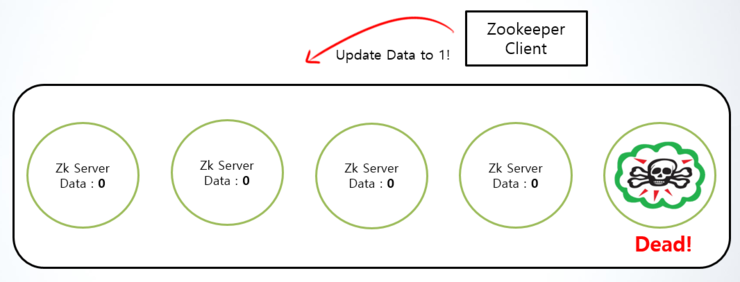
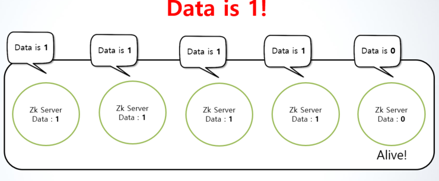
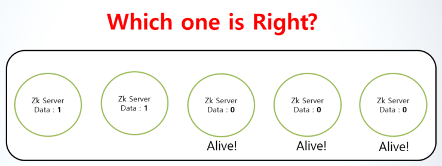
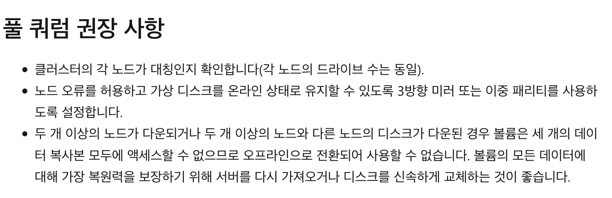

### 2023-05-26

## **Apache Kafka**

### Zookeeper Failover?
```
Zookeeper Failover는 여러대로 이루어진 Zookeeper에서 하나의 서버에 장애가 발생하면 다른 정상 서버로 작업을
자동 이전시킴으로써 서비스의 지속성과 신뢰성을 보장함으로써 고가용성을 유지하는 것이다.
```

- Zookeeper는 홀수개로 동작하는데 3개나 5개로 구성하는 것이 일반적이다. 

    - 그 이유는 **quorum**(정족수, 분산 시스템에서는 다수결 기반으로 동작을 진행시킴으로써 시스템의 일관성, 내결함성을 높이기 위한 합의 알고리즘)을 사용하기 때문이다.

        - 많은 시스템들이 quorum을 통해 failover를 진행한다.(Zookeeper, Window Server[3], Redis Sentinel[4][5] 등)

zookeeper 서버에서 홀수개를 사용하는 이유는 과반수에 의한 투표가 가능하기 때문이다.

다음 예시는 서버가 5개일 때 하나의 서버에서 장애가 발생한 상황이다.



- 하나의 서버가 장애가 발생하고 데이터 변경 요청이 들어왔으므로 다른 서버들이 동기화를 위해 값을 업데이트 되어야 하는 상황이다.



- 4개의 서버 데이터가 업데이트 되었다.

- 이후 죽어있던 서버가 살아나면 데이터 일관성이 맞지 않으므로 투표를 한다.

- **4:1**의 결과로 과반수를 넘었으니 죽어있던 서버의 데이터를 변경함으로써 일관성을 맞춘다.

만약, 짝수개의 서버일 경우 과반수가 없어 어느 데이터가 올바른지 모르기 때문에 홀수개를 사용한다.


---

### 만약 과반수의 서버가 fail된 상태일 경우는?



```
다음 그림과 같이 3개의 서버가 죽어있을 때 데이터가 들어오고 데이터를 맞춰야 하는 상황의 경우
투표 2:3에 의해 올바르지 않은 데이터로 업데이트 될 것이다.
```


- 만약 과반수 이상의 서버가 죽었을 경우 다음과 같은 방법들을 사용한다.

1. 지속적인 데이터 백업을 통해 언제든지 롤백 할 수 있는 상황을 만든다. (백업이니 만큼 백업 시기에 따라 데이터 일관성 및 유실이 생길 수 있다.)

2. 다운된 서버가 올바른 데이터로 판단하고 직접 동기화 하도록 구현한다. (Watcher 사용)


```
Zookeeper와 비슷하게 quorum을 사용하고 있는 Window Server는 3개 이상의 노드가 다운될 경우 오프라인으로 전환되고 
모든 데이터를 복원하기 위해 서버와 디스크를 신속하게 교체하는 것을 권장한다고 한다.
```




---

Reference 
---
[1] FastCampus - Kafka 완전 정복 : 클러스터 구축부터 MSA 환경 활용까지

[2] https://m.blog.naver.com/alice_k106/220614228476

[3] https://learn.microsoft.com/ko-kr/azure-stack/hci/concepts/quorum

[4] https://redis.io/docs/management/sentinel/

[5] http://redisgate.jp/redis/sentinel/sentinel.php
