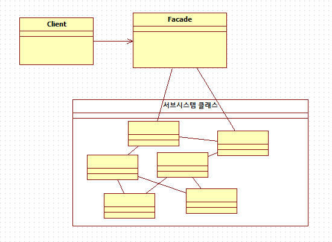
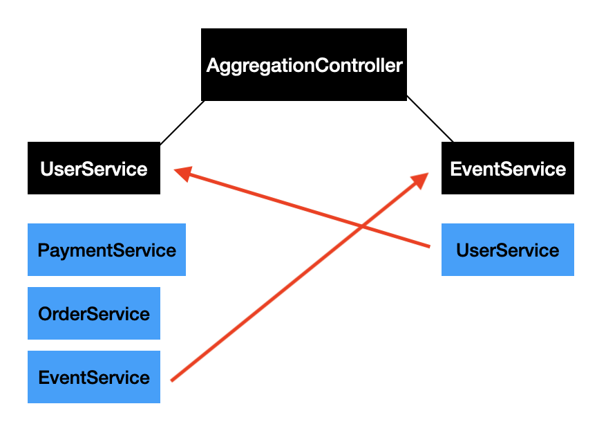
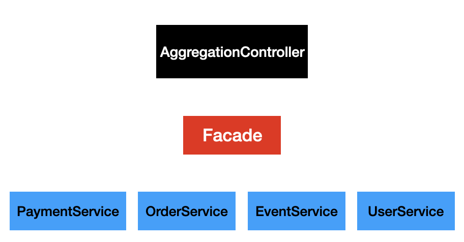

### 2023-06-10

## **Facade Pattern**
---

**Facade Pattern**
```
Facade = 정면
다양한 기능들을 가진 서브 시스템들을 하나의 간략화된 인터페이스로 제공해주는 디자인 패턴이다.
복잡한 하위의 비즈니스 코드들이 상위 코드에 의존하는 일을 감소시켜 준다.
```



위 그림을 보면 Facade라는 Interface는 서브 시스템 클래스와 연결되어 있으며

원래대로 라면 Client가 서브시스템 클래스들을 모두 호출해야 하지만

Facade 만을 호출하여 Client가 원하는 행위를 처리할 수 있게 된다.


---

**Example**

예를 들어, 통합 사이트 회원가입을 할 때 다음과 같은 과정대로 흘러간다고 해보자.

사용자 정보 요청 -> A 사이트 회원가입 -> B 사이트 회원가입 -> C 사이트 회원 가입

위 과정을 코드로 나타내면 다음과 같다.

```Java
public class SiteController {
    @GetMapping("/integratedRegister")
    public void integratedRegisterController(UserInfo userInfo){
        RegisterService.integratedRegister(userInfo);
    }
}
```

```Java
public void integratedRegister(UserInfo userInfo) {
    Register.ASite(userInfo);
    Register.BSite(userInfo);
    Register.CSite(userInfo);
}
```

3개의 사이트 가입을 모두 호출하는 것이 아닌 RegisterService에서 하나의 메소드만 호출해도 모두 가입할 수 있게 된다.

Facade interface를 활용하면 다음과 Controller와 Service 의존성 분리도 가능하다.

```Java
public interface RegisterInterface {
    integratedRegister(UserInfo userInfo);
}
```

Client에서 간단하게 FacadePattern의 integratedRegisterService만 호출하면 통합 사이트 회원가입이 가능하다.

만약 D사이트도 추가 회원가입 해야 한다면 RegisterInterface를 상속받은 integratedRegister에 DSite 회원가입 메소드를 추가해준다.

이렇게 되면 이후 다른 프레임워크로 교체하거나 기능을 추가/수정 해야할 때 Facade의 메소드 구현체들만 수정하면 해결이 가능하다.

---

**구현 방법**

해당 글[1]에서는 Facade 패턴 구현 방법을 다음과 같이 설명한다.

- 더 간단한 인터페이스를 제공함으로써 하위 시스템의 여러 클래스로부터 독립시킨다.

- 인터페이스를 선언하고 구현하자. Client에서 요청한 호출들을 하위 시스템의 로직들로 넘겨 주어야 한다. Facade는 하위 시스템을 관리할 수 있어야 한다.

- 모든 클라이언트 코드를 Facade를 통해서만 하위 시스템에 접근할 수 있도록 한다. 이를 통해 하위시스템 코드 변경 사항들로부터 보호 된다.

- Facade 가 너무 커지면 새로운 Facade를 만들어서 역할을 나누어라.


---

**순환 참조 문제 발생 해결**

일반적으로 구현하던 MVC 형태(Controller -> Service 호출)를 통해 새로운 API를 만들었는데 2개의 Service 클래스에서 메소드들을 호출해야 하는 상황에서 순환 참조 문제가 발생할 수 있다.

Facade를 활용해 쉽게 해결 한다.



UserService -> <- EventService 인 상황



Facade 하나를 두고 둘을 모두 호출하게 만든다.

---

**장점**

- 도메인 분리가 명확해지고 어떤 API에서 호출해도 하나의 인터페이스에서 해결 가능하다.

- 하위 시스템의 구현을 클라이언트가 알지 못함으로써 종속성을 줄이고 캡슐화가 된다.


**단점**

- 추가로 추상화를 해야 하므로 코드 복잡성이 증가하고 계층이 복잡해진다.

- Client가 Facade에 의존해야 한다.


Spring MVC 패턴과 거의 비슷 유사하다.

Facade는 ApplicationService 정도로 생각할 수 있다.

Index
---

[1] https://refactoring.guru/ko/design-patterns/facade

---

Reference
---
[1] https://lktprogrammer.tistory.com/42

[2] https://appleg1226.tistory.com/56
