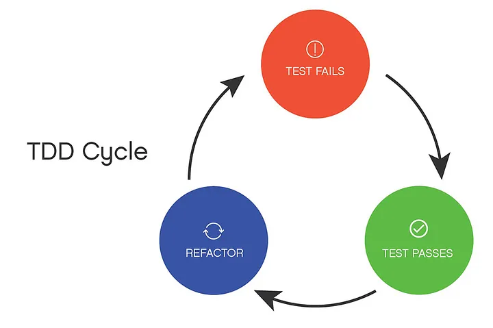

### 2023-06-26

## **Transformation과 Refactoring 간단 정리**

Transformation과 Refactoring은 서로 대응 관계(counterpart)이다.

### Transformation

- Refactoring이 행위의 변경 없이 코드의 구조를 변경하기 위해 소스 코드에 작은 변경을 하는 행위이다.
- Transformation은 이와 반대로 구조의 변경 없이 행위를 변경하기 위해 소스 코드에 작은 변경을 가하는 것이다.

좋은 알고리즘을 얻기 위한 우선 순위 존재
transformation의 우선 순위를 잘 적용하면 보다 나은 알고리즘을 얻을 수 있다는 것을 보여 줌
중요한 구현을 미루는 것이 좋은 알고리즘으로 안내함(ex. guard clause)

---

### Transformation이 TDD의 RGB 중 어디에 적합할까?

TDD의 RGB(빨간색, 녹색, 리팩터링)는 다음과 같다.

**RED** - 실패하는 테스트 케이스를 작성한다. 구현되지 않은 기능에 대한 테스트 케이스 작성이다.

**Green** - 통과하는 테스트 케이스를 작성한다. 코드 품질이나 최적화 보다 '테스트를 통과하기 위한 최소한의 코드'를 작성해야 한다.

**Refactor** - 코드를 개선한다. 통과되는 테스트 이후 코드의 품질 향상을 위한 Refactoring을 진행한다.

- 위 과정 중에 테스트가 실패(RED)하면 구조를 유지한채 성공시(Green)키기 위해 행위를 변경한다. - Transformation

- 테스트가 성공(Green)하면 행위를 유지한채 구조(Refactor)를 개선한다 - Refactoring

Refactor를 진행하면서 그동안 쌓여왔던 기술 부채를 해소하고 품질을 높인다.

테스트를 통과하기 위해 조금씩 작업해야 한다. 처음부터 완벽한 테스트 코드는 안나온다. (아래 Rule에서 추가 설명한다.)

- 실패하는 테스트를 성공시키는데 적용되는 규칙

    - | As the tests get more specific, the code gets more generic

---

### Rule

다음은 테스트 코드를 진행하기 위해 조금씩 작업하면서 천천히 품질을 높여가는 과정이다.

- {} → Nil
    - 아무 코드가 없는 상태에서 시작함
        - 가장 퇴화한 테스트를 작성

        - 컴파일이 되지만 실패해야 함

        - SUT에서 null을 반환

- Nil → Constant
    - 현재 테스트를 통과시키도록 상수를 반환

- Constant → Variable
    - Triangulate(삼각 측량법)를 하면 Constant(상수)로 테스트를 통과시킬 수 없게 됨

    - 이러한 변환들이 계속 매우 구체적인 상태에서 살짝 더 일반적인 상태로 옮김

    - 이런 변환은 모두 일반화, 즉 코드가 이전보다 더 다양한 제약 조건을 처리할 수 있도록 하는 방법임

- Unconditional → Selection
    - 조건문(if) 추가

- Value → List
    - one to many

- Selection → Iteration
    - if → while

- Statement → Recursion
    - 반복문 대신 명령문을 재귀 명령문으로 변경
    
    - 재귀 외에는 별도 반복 기능이 없는 경우에 특히 자주 볼 수 있음

- Value → Mutated Value
    - 변수의 값을 변경
    
    - 반복문에서 부분값들을 모으거나 점진적인 계산을 위해 사용됨

위와 같이 한 단계씩 발전하는는 지속적인 코드 개선을 통해 "Vertical Slicing"를 만들어 가자.

10가지의 기능이 80% 구현된 것보다 5가지의 기능이 100% 구현된 것이 낫다.
    - 한 가지 기능씩 E2E로 완벽하게 구현해 나가자.

--- 

## 비고

둘 이상의 변환을 조합해서 테스트를 통과시키기 위해선 다음과 같은 행동들을 하자.

- 하나 이상의 테스트를 빠뜨린 것일 수 있음.

- 하나의 변환만 사용해서 통과시킬 수 있는 테스트를 찾아보라

- 선택을 해야 한다면 우선순위가 높은 변환을 취하라

순서대로 변환을 적용하다 보면 함수형 프로그래밍 스타일을 사용하는 해법을 구현하게 될 것임.

---

Reference
---
[1] https://github.com/msbaek/memo/blob/master/TPP.md

[2] [소프티어테크톡] "TDD와 리팩토링" - 백명석

[3] https://medium.com/swlh/learning-to-love-tdd-f8eb60739a69
